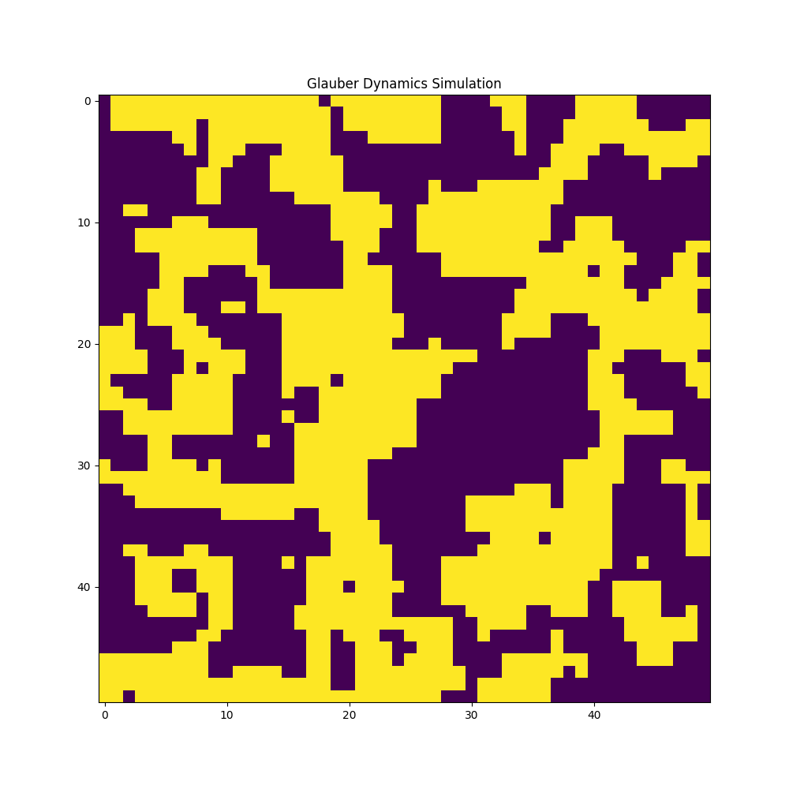
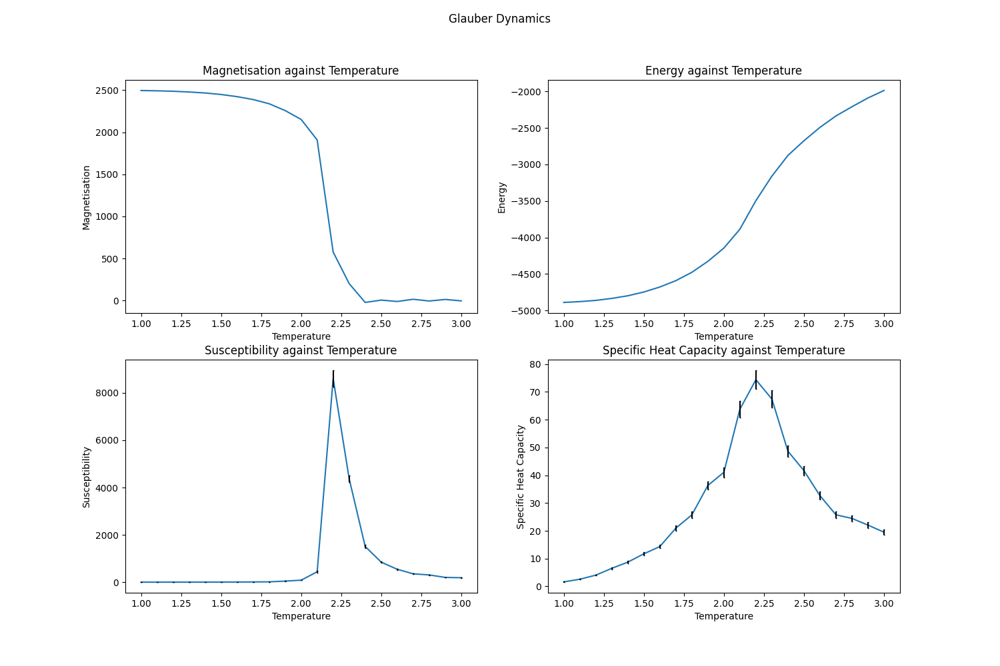

# Ising Model 
Monte-Carlo simulations of ferromagnetic spin systems on a lattice using Markov chains and the Metropolis algorithm to generate states according to the Boltzmann distribution for the Ising Model. We use 2 different Markov chains, one using Glauber dynamics and the other using Kawasaki dynamics. For simplicity, we set the Boltzmann constant to 1 without loss of generality.

## Installing
Download ising.py and import.
```
from ising import IsingModel
```

## Usage
Create an IsingModel object as needed.
```
# ising model parameters
size = 50
temperature = 0.1

model = IsingModel(size, temperature)
```
Initialize the total energy of the system. Note: This is required before running a simulation.
```
model.energy_total()
```
Simulate using Glauber or Kawasaki Dynamics. The simulation is automatically animated on matplotlib.
```
model.sim_glauber()
```
or
```
model.sim_kawasaki()
```

## Glauber Dynamics
We start from a state $\mu$ with energy $E_{\mu}$. 
1. We generate a new candidate state, $\nu$, by choosing a random spin and flipping it.
2. Compute the energy of the new state $E_{\nu}$ and thus the energy difference $\Delta E = E_{\nu} - E_{\mu}$.
3. Metropolis Algorithm:
   - If $\Delta E < 0$, accept the new state as it is energetically favourable.
   - If $\Delta E > 0$, accept the new state with probability $exp(\frac{\Delta E}{k_{B} T})$
  
## Kawasaki Dynamics
Identical to Glauber dynamics but instead of choosing a random spin and flipping it, we choose 2 random spins and swap them with each other. Glauber dynamics has non-conserved magnetization due to flipping the spin, meanwhile Kawasaki conserves the magnetization.

## Measurement
We can measure the properties of the system by running the measurement() method. This method simulates the ising model at the given temperatures, allows the system to reach an equilibrium, then takes 1000 measurements of the magnetization, magnetization squared, energy and energy squared. After measurements are done, the data is saved as a .csv file for each temperature and for the dynamics chosen.
```
dynamics = "g"
temperatures = np.arange(1, 3.1, 0.1).round(1) # Note these are the temperatures to be measured. 
model.measurement(dynamics, temperatures) 
```
This data can then be used to investigate phase transitions, magnetization, energy, susceptibility, specific heat capacity etc.

## Example Simulation, Measurements and Plots


